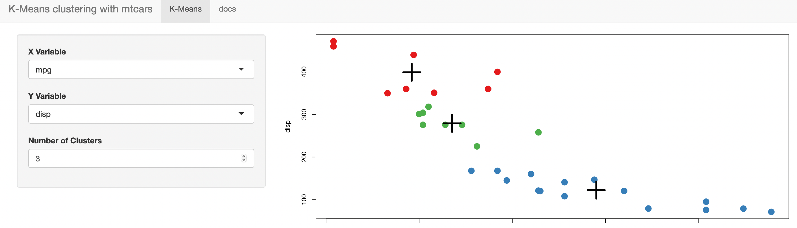

Shiny App Pitch
========================================================
author: Rachel C
date: June 4, 2021
autosize: true

Shiny Application
========================================================

My application is a simple shiny app that displays the k-means clustering for the mtcars data
Here is what the mt cars data looks like

```r
head(mtcars, 3)
```

```
               mpg cyl disp  hp drat    wt  qsec vs am gear carb
Mazda RX4     21.0   6  160 110 3.90 2.620 16.46  0  1    4    4
Mazda RX4 Wag 21.0   6  160 110 3.90 2.875 17.02  0  1    4    4
Datsun 710    22.8   4  108  93 3.85 2.320 18.61  1  1    4    1
```

User Interaction
========================================================
In my application, the user can pick the x column, the y column, and the number of clusters to run k-means on
Shown here is a screenshot of the application



Reproduced R Code
========================================================
The R code to create the plot is shown below, with the x column as displacement, the y column as mpg, and 3 clusters. The plot will appear on the next slide.

```r
clusteredData <- kmeans(mtcars[, c('disp', 'mpg')], 3)
par(mar = c(5.1, 4.1, 0, 1))
plot(x = mtcars$disp, y = mtcars$mpg, col = clusteredData$cluster, pch=20, cex = 3)
points(clusteredData$centers, pch=3, cex = 4, lwd = 4)
```
Reproduced Plot
========================================================
Shown here is what the R code on the previous slide produces.

